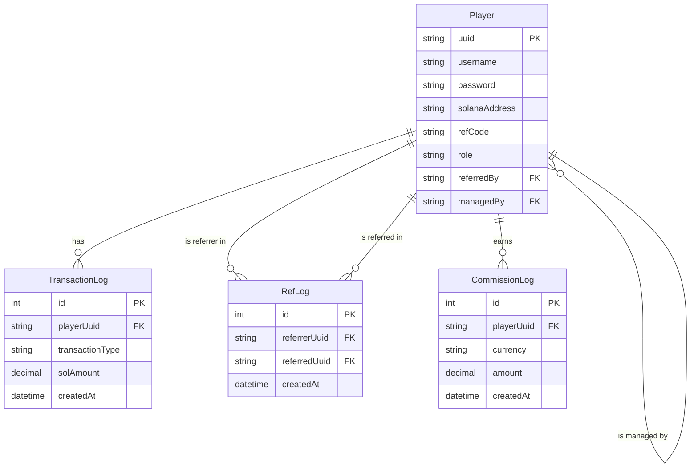

# Database Schema

This document outlines the database schema for the Minepath application. The diagram below illustrates the main entities and their relationships.

## Entity-Relationship Diagram (ERD)

## Entity Descriptions

- **Player**: The central entity representing a user. It stores login credentials, wallet information, referral details, and role (`Admin`, `KOL`, `User`, `BD`).
- **TransactionLog**: Records all transactions in the system, such as deposits or other SOL-related activities. Used to calculate total volume spent by users.
- **RefLog**: Logs every successful referral event, linking a `referrer` to a `referred` user.
- **CommissionLog**: Records every commission (in MINE or SOL) earned by a KOL.

